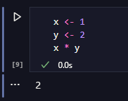
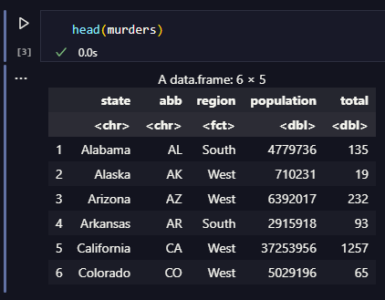

    

<h1 align="center">Projetos em R</h1>

  
  
  
  

<h2> 📒 Descrição </h2>

Repositórios para armazenar projetos simples em linguagem R. Será atualizado ao longo do tempo. Quando ficar com mais de 60 MB será criado um segundo repositório.

<h2> 🖊️ Processos Utilizados </h2>
<ul>
    <li>Tratamento de dados</li>
    <li>Plotagem de gráficos</li>
    <li>Regressão</li>
    <li>Predição</li>
    <li>BI com Tableau</li>
</ul>

<h2> &#128196; Datasets </h2>
<ul>
    <li>
        Murders -> biblioteca <em>dslabs</em>
    </li>
    <li>
        Black Friday
    </li>
</ul>

<h2> &#128213; Bibliotecas </h2>
<ul>
    <li>
        <a href="https://www.rdocumentation.org/packages/dslabs/versions/0.8.0"> dslabs </a>
    </li>
    <li>
        <a href="https://www.rdocumentation.org/packages/ggplot2/versions/3.5.0"> ggplot2 </a>
    </li>
    <li>
        <a href="https://www.rdocumentation.org/packages/dplyr/versions/1.0.10"> dplyr </a> 
    </li>
    <li>
        <a href="https://rdocumentation.org/packages/corrgram/versions/1.14/topics/corrgram"> corrgram </a>
    </li>
    <li>
        <a href="https://www.rdocumentation.org/packages/tidyverse/versions/2.0.0"> tidyverse </a>
    </li>
</ul>

<h2> &#128204; Executar R com Jupyter Notebook no VSCode </h2>
<ol>
    <li>Instale a linguagem R: <a>https://www.r-project.org/</a></li>
    <li>Instale RTools: <a>https://cran.r-project.org/bin/windows/Rtools/</a></li>
    <li>No Terminal R execute:</li>
        <ul>
            <li>
                <code>install.packages("IRkernel")</code>
            </li>
        </ul>
    <li>No VsCode:</li>
        <ol>
            <li>Instale as extensões:
                <ul>
                <li>ms-toolsai.jupyter</li>
                <li>REditorSupport.r</li>
                <li>RDebugger.r-debugger</li>
                </ul>
            </li>
            <li>
                Execute no terminal: <code>pip install jupyter_client</code>
            </li>
            <li>
                Abra um R Terminal e execute: <code>IRkernel::installspec()</code>
            </li>
            <li>Crie um Jupyter Notebook</b></li>
            <li>Escolha o kernel R</b></li>
            <li>Crie um Project Environment (renv) caso necessário</b></li>
        </ol>
</ol>
<ul>
  
</ul>
